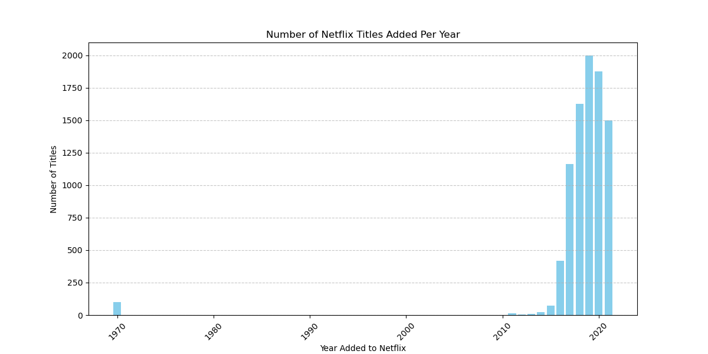
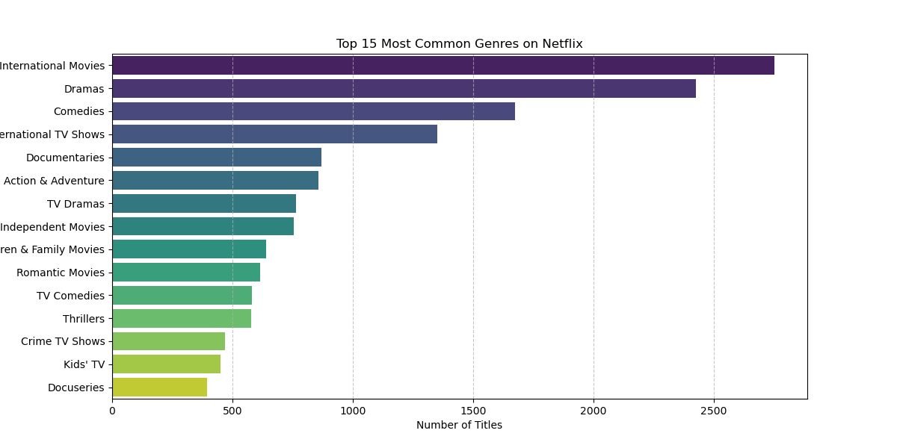
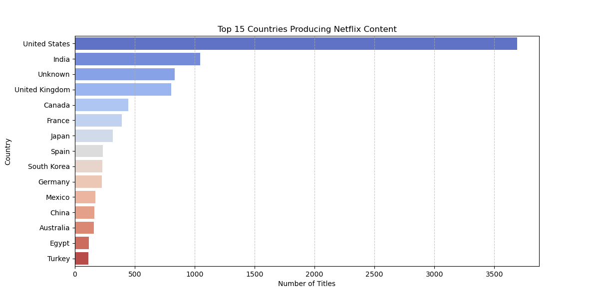
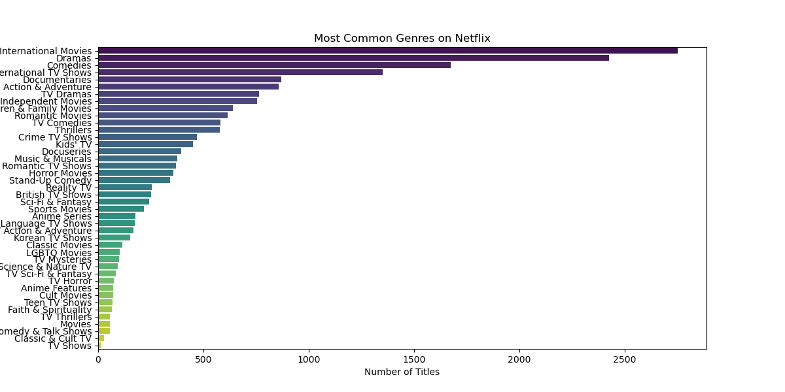

# 📺 Netflix Data Analysis (Kaggle Dataset)

## 🎯 Project Overview
This project explores a **Netflix dataset from Kaggle** containing movies and TV shows.  
Using Python and Pandas, I performed **data cleaning, exploratory analysis, and visualization**  
to uncover **trends in Netflix content**, such as:  
- 📈 How Netflix's content library has grown over time  
- 🎭 The most popular genres and how they’ve changed  
- 🌍 Which countries produce the most Netflix content  
- 🔞 Content rating trends (PG, TV-MA, etc.)  
- 🎬 Movie vs. TV Show duration trends  

## 🛠️ Tools Used
- **Python (Jupyter Notebook)**
- **Pandas & NumPy** (Data Cleaning)
- **Matplotlib & Seaborn** (Visualization)
- **Plotly** (Interactive Charts)

## 📊 Key Insights
1. **Netflix added the most content between 2016-2020.**
2. **The most common genres are Dramas, Comedies, and Documentaries.**
3. **The USA, India, and the UK contribute the most titles.**
4. **TV-MA is the most common rating, meaning more mature content is being added.**
5. **Netflix movies tend to be getting longer over time.**

## 🖼️ Sample Visualizations
  
  

## 📂 Files in This Repository
- `netflix_analysis.ipynb` → Jupyter Notebook with the full analysis  
- `netflix_cleaned.csv` → Cleaned dataset for further use  
- `README.md` → This documentation  

## 🔥 Next Steps
🚀 Future improvements:  
- **📈 Machine Learning Predictions** → Predicting what type of content Netflix will add next.  
- **📊 Interactive Dashboards** → Using Power BI or Tableau for real-time filtering.  
- **🧠 Sentiment Analysis** → Analyzing descriptions to understand content themes.  

---
📢 **Interested?** Fork this repo and explore the data! 🚀

## 📊 Netflix Data Visualizations

### 🎬 Number of Titles Added Per Year

### 📈 Movie vs. TV Show Distribution

### 🎭 Most Common Netflix Genres

### 🌍 Content by Country

### 🔥 Genre Trends Over Time
